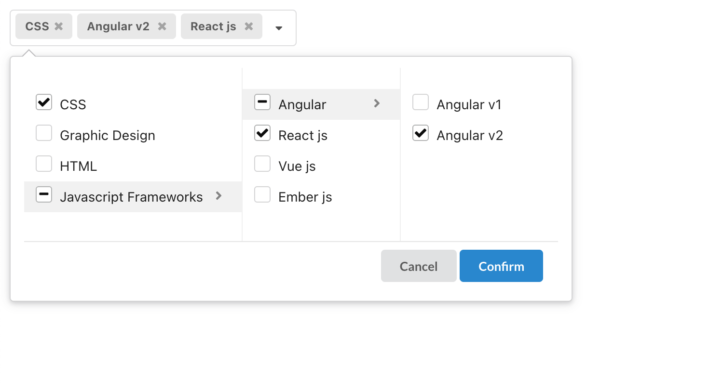

# semantic-multi-cascader

 

[](https://www.npmjs.com/package/semantic-multi-cascader)

A multiple cascader component for semantic

[](https://npmjs.org/package/semantic-multi-cascader)

<div style="max-width: 420px">
  
</div>

## How to use?

```shell
npm install semantic-multi-cascader
```

or

```shell

yarn add semantic-multi-cascader
```

```js
const [value, setValue] = React.useState([]);
const options = [
  { text: "CSS", value: "css" },
  { text: "Graphic Design", value: "design" },
  { text: "HTML", value: "html" },
  {
    text: "Javascript Frameworks",
    value: "javascript frameworks",
    children: [
      {
        text: "Angular ",
        value: "angular ",
        children: [
          { text: "Angular v1 ", value: "angular v1 " },
          { text: "Angular v2 ", value: "angular v2 " },
        ],
      },
      { text: "React js ", value: "React js" },
      { text: "Vue js ", value: "Vue js" },
      { text: "Ember js ", value: "Ember js" },
    ],
  },
];
return (
  <MultiCascader
    value={value}
    onChange={setValue}
    options={options}
    placeholder="Select Skills"
  />
)
```

### Props

| Props               | Type                                                                                | Description                                                                                                                                                           |
| ------------------- | ----------------------------------------------------------------------------------- | --------------------------------------------------------------------------------------------------------------------------------------------------------------------- |
| value               | string[]                                                                            | Selected value                                                                                                                                                        |
| options                | TreeNode[]  (required)                                                                        | Cascader options TreeNode  see [Options Props](#options-props)                                                                      |
| allowClear          | boolean    (optional)                                                                         | Whether allow clear                                                                                                                                                   |
| placeholder         | string    (required)                                                                          | The input placeholder                                                                                                                                                 |
| onChange            | (newVal) => void (required)                                                                   | Callback when finishing value select                                                                                                                                  |
| selectAll           | boolean       (optional)                                                                      | Whether allow select all                                                                                                                                              |
| className           | string    (optional)                                                                          | The additional css class                                                                                                                                              |
| style               | React.CSSProperties (optional)                                                                | The additional style                                                                                                                                                  |
| disabled            | boolean        (optional)                                                                     | Whether disabled select                                                                                                                                               |
| okText              | string      (optional)                                                                        | The text of the Confirm button                                                                                                                                        |
| cancelText          | string       (optional)                                                                       | The text of the Cancel button                                                                                                                                         |
| selectAllText       | string    (optional)                                                                          | The text of the SelectAll radio                                                                                                                                       |
| maxTagCount         | number \| responsive (optional)                      |  Max tag count to show. responsive will cost render performance                                                                                                                                          |

### Options Props

| Props               | Type                                                                                | Description                                                                                                                                                           |
| ------------------- | ----------------------------------------------------------------------------------- | --------------------------------------------------------------------------------------------------------------------------------------------------------------------- |
| text               | string    (required)                                                                      |  Displayed text                                                                                                                  |
| value               | string   (required)                                                                       | Selected value                                                                                                                                                        |
| children?               | TreeNode  (optional)                                                                          |  Nested children  (same options props )                                                                                                                                                       |
| isLeaf?               | boolean  (optional)                                                                          |  Tell component this node is a leaf node                                                                                                                                                        |

## Contributing

The people who contribute to semantic-multi-cascader do so for the love of open source, our users and ecosystem, and most importantly, pushing the web forward together.Developers like you can help by contributing to rich and vibrant documentation, issuing pull requests to help us cover niche use cases, and to help sustain what you love about semantic-multi-cascader. Anybody can help by doing any of the following: use semantic-multi-cascader in projects,Contribute to the core repository.

All pull requests are welcome !

## Changelog

Please see [CHANGELOG](CHANGELOG.md) for more information what has changed recently.

## License

semantic-multi-cascader uses the MIT license. See [LICENSE](LICENSE.md) for more details.
